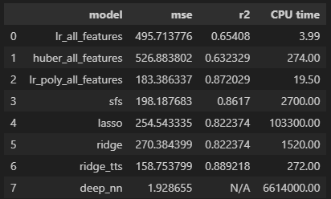
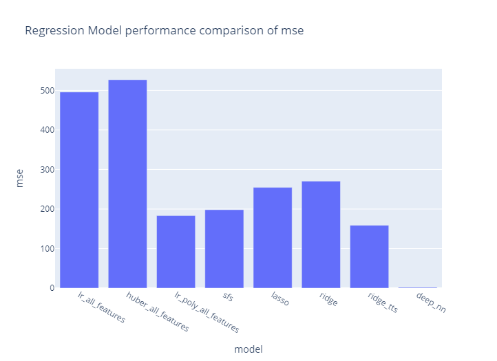
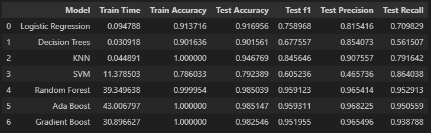
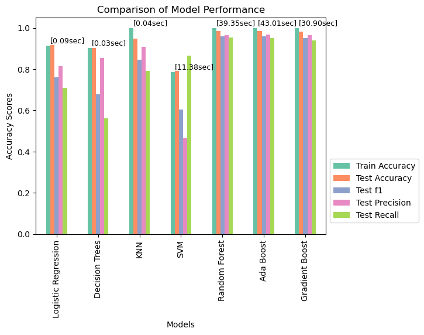
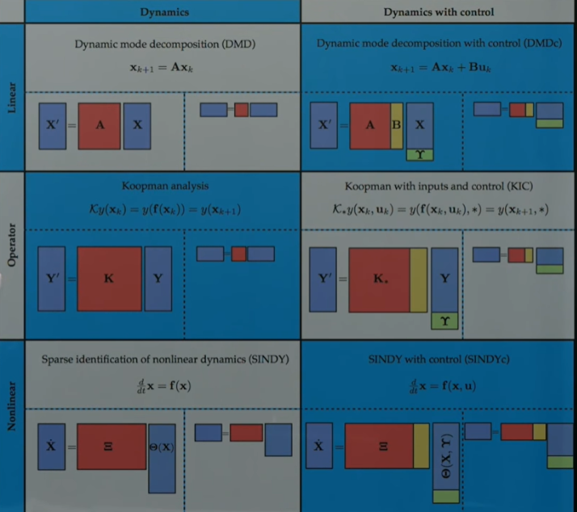

# Report: Data-driven Control System

## Introduction

In this project, I'd like to explore the data-driven control and dynamic systems using Machine Learning/ Deep Learning techniques.
My objective was to use the given dataset (processed measurements from the physical vehicles CAN bus) and applying ML techniques such as the Regressions & Classifier models to determine if this black-box approach is reasonable for deducing System Identification (SysID) in Control systems. If yes, this would open up new opportunities in the controls field that we can do control systems without knowing much about its full system dynamics. 

Classical controls and dynamics systems are expressed in terms:
$$\
   	\dot{x} = Ax+Bu,
$$

$$\
	y= Cx
$$

where:
* X: a state vector or state variable of the system. It typically represents the internal state or variables of a dynamic system that evolves over time.
* X_dot: The derivative of the state vector X with respect to time, indicating how the state variables change over time.
* A: A matrix that describes the dynamics or evolution of the state variables. It defines how the state variables interact and change over time in the absence of any inputs or disturbances.
* B: A matrix that represents the control input vector or the effect of external inputs on the state variables. It shows how the system responds to control inputs or external influences.
* u: The control input vector or the input applied to the system to affect its behavior or state evolution. It can be considered as the driving force or external signal acting on the system.
* y: The output vector that represents the measurable or observable variables of the system. It is derived from the state variables or directly observed from the system.
* C: A matrix that relates the state variables to the output variables. It defines how the state variables contribute to the output measurements or observations.

The Machine Learning techniques provide a new set of tools that can help to understand the system dynamics, thus enabling developing the controls systems  **without knowing the full system dynamics**.

In this exercise, 
1. Using Regression technique, we can predict the desired outputs Y (i.e, Vehicle Speed) 
2. Using Classifiers, we can predict the control inputs U (i,e. Brake Voltage)

References: http://databookuw.com/databook.pdf 

## Methodology

I started by investigating and cleaning the dataset. I eliminated null values and columns that did not contribute to our analysis. Afterwards, I did exploratory data analysis to detect any patterns or correlations in the data.

Following this, I constructed multiple regression models using various techniques, including linear regression, ridge regression, lasso regression, and gridsearch. Using MSE, R2 scores and feature significance ratings, I determined the performance of each model. The Vehicle Speed is the target output for the regression, as a measurement output Y in the dynamic model. 

In the second half, I constructed multiple classifer models using Decision Trees, KNN, SVM, Logistic Regression, and also some Ensemble models such as Random Forest, Ada Boost or Gradient Boost. The target is the controls input U, such as Brake Voltage, Steer Angles, and Acceleration Pedal. Those data were binary-classified to mimic the user inputs.

All the model performances are being evaluated and compared to identify the best ones.

## Findings
As we see in the performance plots, the Regression model using Deep Neural Network seems to perform best with best MSE value, but worst CPU runtime. From a distance, the second best model based on MSE score is the Ridge Regularization with TransformTargetRegression techniques.

Overall, this is a significant step to use Regression technique to determine the output measurement Vehicle Speed, given the reduced order model (ROM) of the system dynamics. Please note that, most of the significant features related to the Vehicle speed are intentially dropped based on VIF scores, Still the model is able to deduce the Vehicle speed based on the hidden relationship among data points, i.e. hidden Non-linear system dynamics.

Furthermore, using the Classifier models to back out the control inputs (such as the Brake Voltage), the results are also impressive. Out of all the models tested, Random Forest, Ada Boost, and Gradient Boost are the winners, with test accuracies in the range of 98+%, which indicates that the data-driven models can deduce the controls inputs values very well. Using this, we can forecast the next controls input values in descrete time, and use it to controls the hidden system dynamics of the vehicles!

Yet, it is crucial to highlight that the other models still give some helpful insights into the variables that influence the system dynamics. For example, the linear regression model emphasizes the significance of the Brake Voltage to the vehicle speed, while the ridge and lasso regression models stress the significance of the ambient temperature.

## Recommendations

The results are very encouraging and promising, such that: 
* Using regression with the Vehicle Speed as a target value, the Deep Neural Network model can estimate very well the Vehicle speed without significant measurements such as torques, angles, in a reduced order model (ROM).
* Using classifiers with the Brake Voltage as a target value (in terms of control inputs), the Gradient Boost model can estimate the control input very well with the test accuracy in the range of 98%. This suggests that we can use this model to forecast the controls inputs and thus able to control and manipulate the system dynamics without fully knowing it.
* Future work of this will include:
  * run the models with other datasets of other trips
  * run the models with Multiple Outputs (for all other controls inputs)
  * deducing the system dynamics (i.e. System identification) once we have the controls inputs and the output measurements from the 2 techniques above.
  
  * anomaly detection models for time-series for predictive maintenance purposes

## Conclusion
In summary, the data-driven approach gives important insight into the controls and dynamics systems that are very challenging to obtain via the traditional approach of mathematical models. Using Machine Learning techniques such as Regression and Classifiers, we are able to estimate and back out the full measurements and controls inputs in a reduced-order model (ROM), thus enabling us to back out the system states and dynamics with much less effort than before.